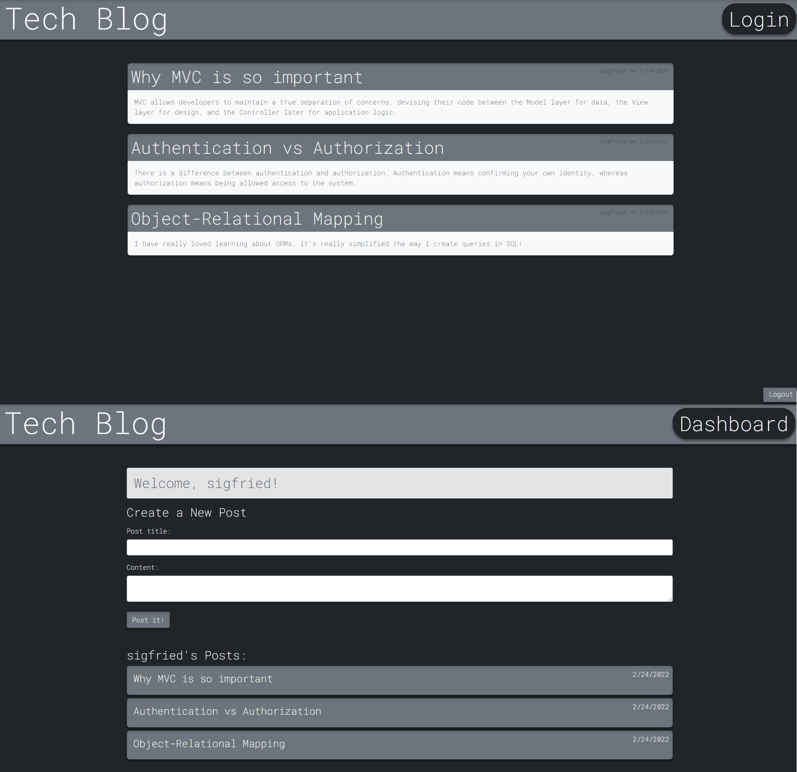

# Tech Blog 

  ## Description
  
  
Tech Blog is a CMS-style blog site that can be used to publish articles, posts, thoughts and opinions. It also allows logged in users to comment and publish their own posts. The process of building this application followed the MVC paradigm. It uses handlebars, Express.js, Sequelize, and several packages.

  
  ## Table of Contents
  
  - [Installation](#installation)
  - [Usage](#usage)
  - [License](#license)
  - [Contributing](#license)
  - [Tests](#license)
  - [Questions](#license)
  
  ## Installation
  
  
- Enter the link https://serene-fortress-93991.herokuapp.com/

  
  ## Usage
  
  
- Follow installation instructions. 
- Create sign up. 
- Enjoy

  
  

  
  ## License
  
  
Copyright (c) 2022, Cesar Sanchez All rights reserved.
Licensed under the MIT license. 

  
  
[License](./MIT_license.txt)

  
  ## How to Contribute
  
  
Add search functionality

  
  ## Tests
  
  
Enter the link https://serene-fortress-93991.herokuapp.com/ -Sign up -Enter new posts and comments to test the functionality.

  
  ## Questions
  
  If you have any question feel free to check my Github 
  
Username:[csancheze](https://github.com/csancheze)

  or send me and email
  
<cesanchezescgmail.com>

